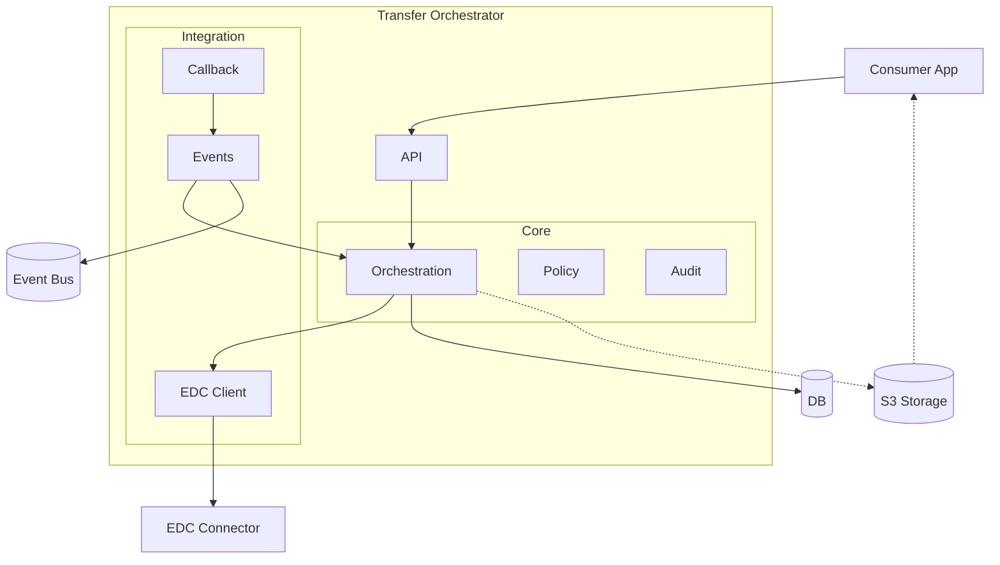
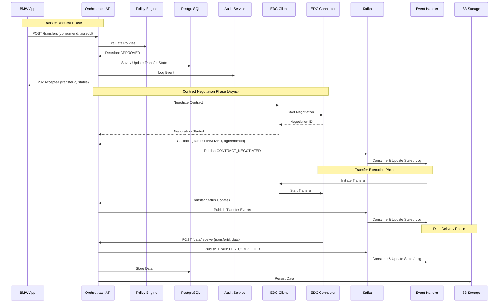
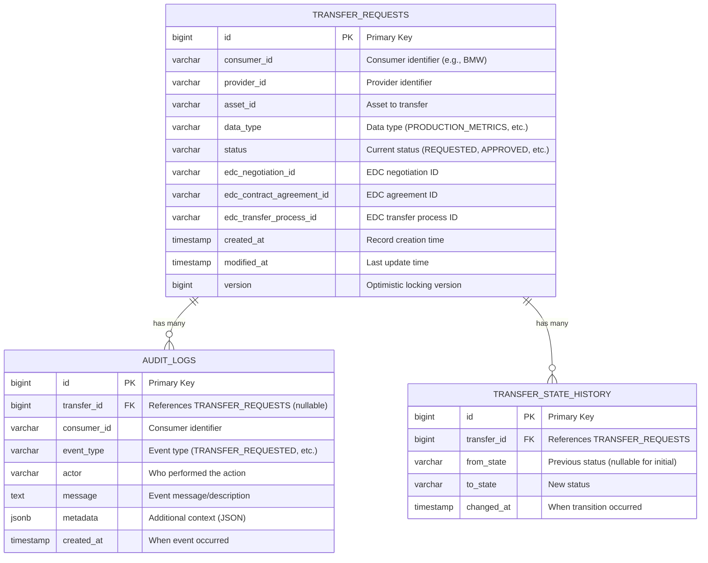

# Architecture Documentation

## Table of Contents
- [Component Diagram](#component-diagram)
- [Sequence Diagram](#sequence-diagram)
- [Database Schema (ERD)](#database-schema-erd)
- [Technology Stack Justification](#technology-stack-justification)

---

## Component Diagram

This diagram shows the main components and their interactions in the Transfer Orchestration Service.



### Component Responsibilities

| Component | Responsibility |
|-----------|----------------|
| **API** | REST endpoints for transfer requests and status queries |
| **Orchestration** | Coordinates transfer lifecycle and state transitions |
| **Policy** | Evaluates access and usage policies |
| **Audit** | Records immutable audit logs for compliance |
| **EDC Client** | Communicates with EDC for contract negotiation and transfers |
| **Callback** | Receives asynchronous callbacks from EDC |
| **Events** | Manages event publishing and consumption via Kafka |
| **EDC Connector** | External dataspace connector for data sovereignty |
| **S3 Storage** | Optional data lake for pull-based data delivery |
| **DB** | Persistent storage for state, policies, and audit trails |
| **Event Bus** | Asynchronous event streaming infrastructure |

---

## Sequence Diagram

This diagram shows the complete flow when BMW initiates a data transfer request.



### Flow Summary

#### Phase 1: Transfer Request
1. Consumer submits transfer request to API
2. Policy engine evaluates policies and returns decision
3. API persists state to database and logs audit event
4. Consumer receives async acknowledgment with transfer ID

#### Phase 2: Contract Negotiation (Async)
5. API initiates contract negotiation via EDC Client
6. EDC connector processes negotiation and returns negotiation ID
7. EDC sends callback when contract is finalized
8. API publishes CONTRACT_NEGOTIATED event to Kafka
9. Event handler consumes event and updates transfer state

#### Phase 3: Transfer Execution
10. Event handler triggers transfer initiation via EDC Client
11. EDC connector starts data transfer process
12. EDC sends status updates to API during transfer
13. API publishes transfer events; handler updates state

#### Phase 4: Data Delivery
14. EDC delivers data to orchestrator via callback
15. API publishes TRANSFER_COMPLETED event to Kafka
16. Event handler updates final state and logs completion
17. API persists data to database and optionally to S3 storage

---

## Database Schema (ERD)



### Table Descriptions

#### TRANSFER_REQUESTS
Primary table storing all transfer requests and their current state.

**Key Columns:**
- `id` - Primary key (auto-generated)
- `status` - Current transfer status (Enum: REQUESTED, POLICY_EVALUATION, APPROVED, DENIED, CONTRACT_NEGOTIATION, NEGOTIATED, TRANSFER_IN_PROGRESS, COMPLETED, FAILED, CANCELLED)
- `data_type` - Type of data being transferred (PRODUCTION_METRICS, QUALITY_REPORTS, etc.)
- `edc_*` - Integration fields linking to EDC resources
- `consumer_id` / `provider_id` - Business partner identifiers
- `version` - Optimistic locking to prevent concurrent updates

**Optimistic Locking:**
Uses `@Version` annotation for concurrent update detection - prevents race conditions when multiple processes update the same transfer.

---

#### AUDIT_LOGS
Append-only immutable audit trail for compliance and traceability.

**Key Columns:**
- `id` - Primary key (auto-generated)
- `transfer_id` - Foreign key to transfer_requests (nullable - some events not tied to specific transfer)
- `consumer_id` - Consumer identifier for filtering
- `event_type` - Type of event (TRANSFER_REQUESTED, POLICY_EVALUATED, STATE_CHANGED, etc.)
- `actor` - Who/what performed the action (USER, SYSTEM, POLICY_ENGINE, EDC_CALLBACK)
- `message` - Human-readable event description
- `metadata` - JSONB field with additional structured context
- `created_at` - Event timestamp (immutable)

**Characteristics:**
- **Append-only** - No updates or deletes allowed
- **JSONB metadata** - Flexible storage for event-specific data
- **Consumer-scoped** - Can track all events for a consumer across transfers
- **Indexed** - Fast queries by transfer_id, consumer_id, and timestamp

---

#### TRANSFER_STATE_HISTORY
Tracks all state transitions for each transfer.

**Key Columns:**
- `id` - Primary key (auto-generated)
- `transfer_id` - Foreign key to transfer_requests
- `from_state` - Previous status (nullable for initial REQUESTED state)
- `to_state` - New status
- `changed_at` - When transition occurred

**Purpose:**
- **State Audit Trail** - Complete history of transfer progression
- **Analytics** - Calculate time spent in each state
- **Debugging** - Investigate stuck transfers or unexpected transitions
- **SLA Tracking** - Measure transfer completion times

**Differences from AUDIT_LOGS:**
- **TRANSFER_STATE_HISTORY**: Only state transitions (lightweight, structured)
- **AUDIT_LOGS**: All events including policy evaluations, errors, etc. (comprehensive, flexible)

---

## Technology Stack Justification

### Core Framework

#### Spring Boot 3.5.6
**Why:**
- **Rapid Development** - Auto-configuration and starter dependencies accelerate development
- **Production-Ready** - Built-in health checks, metrics, and monitoring via Actuator
- **Extensive Ecosystem** - Rich integration with databases, messaging, security
- **Microservice Support** - Native support for RESTful APIs, event-driven patterns
- **Enterprise-Grade** - Battle-tested in production environments worldwide

**Alternatives Considered:**
- **Micronaut** - Lower memory footprint, but Spring Boot has broader community support

---

### Database

#### PostgreSQL
**Why:**
- **ACID Compliance** - Critical for financial/compliance data integrity
- **JSON Support** - Native JSONB for flexible audit log details
- **Performance** - Excellent query optimizer and indexing capabilities
- **Advanced Features** - Window functions, CTEs for complex analytics queries
- **Proven Reliability** - Industry standard for transactional workloads

**Use Cases in Project:**
- Transfer state storage with strict consistency
- Append-only audit logs with JSONB details
- Complex compliance reporting with window functions

**Alternatives Considered:**
- **MySQL** - Less robust JSON support

---

### Message Broker

#### Apache Kafka
**Why:**
- **Event Streaming** - Perfect for transfer lifecycle events
- **High Throughput** - Handles millions of events per second
- **Event Sourcing** - Durable event log enables replay and debugging
- **Decoupling** - Asynchronous communication between components
- **Fault Tolerance** - Replication and partitioning for reliability
- **Consumer Groups** - Multiple consumers for scalability

**Use Cases in Project:**
- EDC callback events (contract negotiated, transfer progress)
- Transfer state change notifications
- Audit event streaming
- Retry handling for failed events

**Kafka Topics:**
```
- transfer.requested
- policy.approved
- policy.rejected
- negotiation.completed
- transfer.in-progress
- transfer.completed
- transfer.failed
- orchestrator-dlq (Dead Letter Queue)
```

**Alternatives Considered:**
- **RabbitMQ** - Simpler, but lacks Kafka's durability and replay capabilities

---

### Cache

#### Redis
**Why:**
- **In-Memory Performance** - Microsecond latency for hot data
- **Rate Limiting** - Built-in support for sliding window rate limits
- **Caching** - Reduce database load for frequently accessed transfers
- **Simple Data Structures** - Strings, Sets, Sorted Sets for various use cases

**Use Cases in Project:**
- Cache transfer status for fast lookups
- Rate limit tracking per consumer
- Session storage (if authentication added)

**Cache Strategy:**
- **TTL**: 5 minutes for transfer status
- **Eviction**: LRU (Least Recently Used)
- **Invalidation**: On transfer state change

**Alternatives Considered:**
- **Memcached** - Simpler, but lacks data structures and persistence options
- **Hazelcast** - More features, but adds complexity

---

### EDC Integration

#### Mock EDC + Real EDC Client Interface
**Why:**
- **Development Velocity** - No external EDC needed for local development
- **Testing** - Deterministic test scenarios
- **Interface Segregation** - Clean abstraction allows swapping mock/real implementation
- **Production Ready** - Same client interface works with real EDC

**Mock Capabilities:**
- Simulates contract negotiation delays
- Configurable failure scenarios
- Scheduled callbacks via thread pool
- Matches real EDC API contracts

**Real EDC Integration Path:**
```java
@Profile("production")
public class RealEdcConnectorClient implements EdcConnectorClient {
    // Implementation using EDC Management API
}
```

---

### Build Tool

#### Gradle 9.2.1
**Why:**
- **Performance** - Faster than Maven, incremental builds
- **Flexibility** - Kotlin/Groovy DSL for complex build logic
- **Dependency Management** - BOM support, version catalogs
- **Task Customization** - Easy to add custom tasks (e.g., dockerBuildImage)
- **Build Cache** - Speeds up CI/CD pipelines

**Alternatives Considered:**
- **Maven** - More verbose, slower builds

---

### Observability

#### Spring Actuator + Micrometer + Prometheus
**Why:**
- **Zero Configuration** - Auto-configured metrics out of the box
- **Standard Metrics** - JVM, HTTP, database, Kafka metrics
- **Prometheus Integration** - Industry standard for metrics collection
- **Vendor Neutral** - Micrometer facade supports multiple backends
- **Health Checks** - Kubernetes-ready liveness/readiness probes

**Metrics Exposed:**
- `http.server.requests` - API request metrics
- `jvm.memory.used` - JVM memory consumption
- `kafka.consumer.fetch.total` - Kafka throughput
- `hikaricp.connections.active` - Database connection pool

**Alternatives Considered:**
- **Dropwizard Metrics** - Less integrated with Spring Boot
- **Custom Metrics** - Reinventing the wheel

---

### API Documentation

#### SpringDoc OpenAPI 3
**Why:**
- **Auto-Generated** - Scans controllers to generate OpenAPI spec
- **Interactive UI** - Swagger UI for testing APIs
- **Standards-Based** - OpenAPI 3.0 standard
- **Zero Maintenance** - Stays in sync with code

**Access:**
- Swagger UI: `http://localhost:8080/swagger-ui.html`
- OpenAPI JSON: `http://localhost:8080/v3/api-docs`

**Alternatives Considered:**
- **Springfox** - Deprecated in favor of SpringDoc

---

### Testing

#### JUnit 5 + Mockito + Testcontainers + Awaitility
**Why:**
- **JUnit 5** - Modern testing framework with better extension model
- **Mockito** - Industry standard mocking framework
- **Testcontainers** - Real PostgreSQL/Kafka for integration tests
- **Awaitility** - Elegant async testing for Kafka consumers

**Test Pyramid:**
```
E2E Tests (Few)
    ↑
Integration Tests (Some) - Testcontainers
    ↑
Unit Tests (Many) - Mockito
```

**Alternatives Considered:**
- **Embedded H2** - Not representative of production PostgreSQL
- **WireMock** - Less intuitive than Testcontainers

---

## Architecture Patterns Applied

### 1. Layered Architecture
```
API Layer (Controllers)
    ↓
Domain Layer (Services, Entities)
    ↓
Infrastructure Layer (Repositories, Clients, Kafka)
```

### 2. Event-Driven Architecture
- Asynchronous communication via Kafka
- Event sourcing for audit trail
- Eventual consistency for transfer state

### 3. State Machine Pattern
- Strict state transitions enforced
- Idempotent state updates
- Audit log for every transition

### 4. Repository Pattern
- Abstract database access
- JPA repositories for persistence
- QueryDSL for complex queries

### 5. Retry Pattern
- Exponential backoff for transient failures (future)
- Circuit breaker for cascading failures (future)
- Dead Letter Queue for non-retriable errors

---

## Conclusion

This architecture provides:
- ✅ **Scalability** - Horizontal scaling via Kubernetes
- ✅ **Reliability** - Event-driven async processing with retries
- ✅ **Observability** - Comprehensive metrics and health checks
- ✅ **Maintainability** - Clean layered architecture
- ✅ **Extensibility** - Plugin architecture for policies
- ✅ **Compliance** - Immutable audit trail

The technology choices prioritize **proven enterprise solutions** over cutting-edge but unproven technologies, ensuring production reliability while maintaining developer productivity.