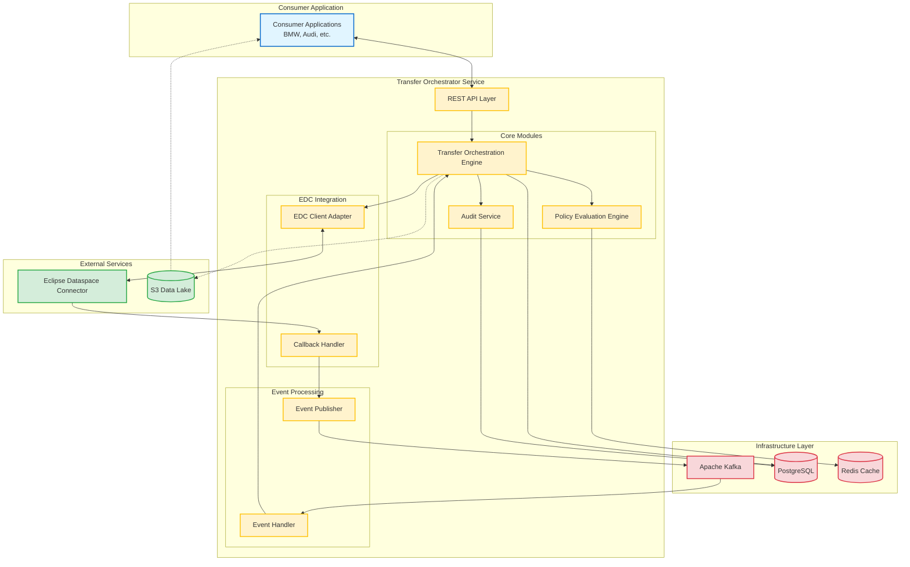
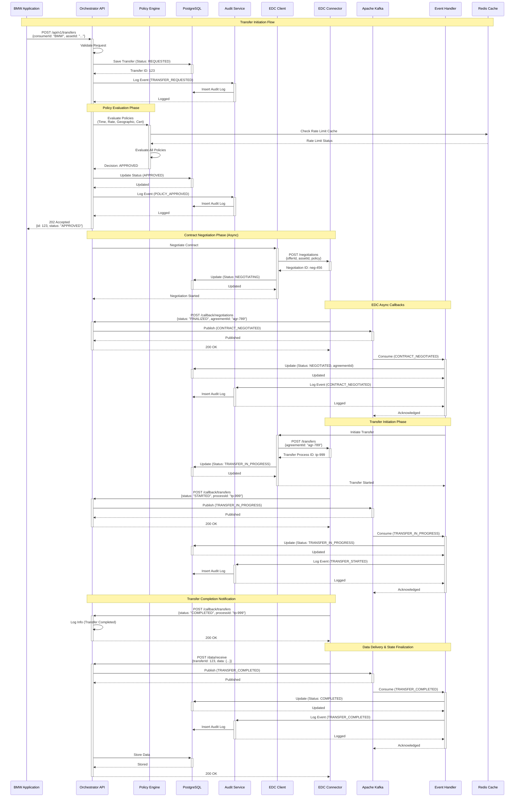
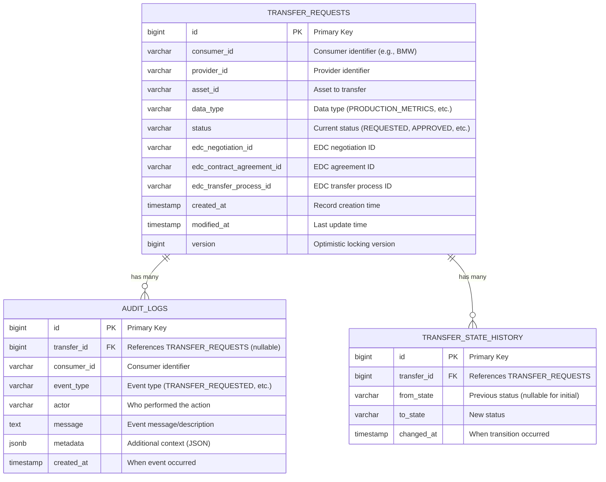

# Architecture Documentation

## Table of Contents
- [Component Diagram](#component-diagram)
- [Sequence Diagram](#sequence-diagram)
- [Database Schema (ERD)](#database-schema-erd)
- [Technology Stack Justification](#technology-stack-justification)

---

## Component Diagram

This diagram shows the main components and their interactions in the Transfer Orchestration Service.



### Component Responsibilities

| Component | Responsibility |
|-----------|----------------|
| **REST API Layer** | Exposes RESTful endpoints for transfer requests, status queries, and consumer interactions |
| **Transfer Orchestration Engine** | Coordinates transfer lifecycle, state transitions, and multi-step workflows |
| **Policy Evaluation Engine** | Evaluates composable policies (time-based, rate limit, geographic, certification) |
| **Audit Service** | Records immutable audit logs for compliance, traceability, and analytics |
| **EDC Client Adapter** | Abstracts EDC Management API for contract negotiation and transfer initiation |
| **Callback Handler** | Receives and processes asynchronous callbacks from EDC connector |
| **Event Publisher** | Publishes transfer lifecycle events to Kafka topics |
| **Event Handler** | Consumes events from Kafka and triggers state updates in orchestration engine |
| **Eclipse Dataspace Connector** | External EDC instance handling data sovereignty and contract enforcement |
| **S3 Data Lake** | Optional external storage supporting pull and push data delivery patterns |
| **PostgreSQL** | Primary transactional database for state, policies, and audit trails |
| **Redis Cache** | In-memory cache for rate limiting, session state, and hot data |
| **Apache Kafka** | Event streaming backbone for asynchronous, decoupled communication |

---

## Sequence Diagram

This diagram shows the complete flow when BMW initiates a data transfer request.



### Flow Summary

1. **Transfer Request** - BMW submits transfer request via REST API
2. **Validation** - API validates and persists request (Status: REQUESTED)
3. **Policy Evaluation** - Policy engine evaluates all applicable policies
4. **Approval** - If approved, status changes to APPROVED
5. **Contract Negotiation** - EDC Client initiates contract negotiation with EDC
6. **EDC Callback** - EDC sends callback when contract is finalized
7. **Kafka Event** - Callback publishes event to Kafka
8. **Event Processing** - Event handler consumes event and updates status
9. **Transfer Initiation** - Transfer process starts with EDC
10. **Progress Updates** - EDC sends progress callbacks via Kafka
11. **Completion Notification** - EDC sends `/callback/transfers` with COMPLETED status (orchestrator just logs)
12. **Data Delivery** - EDC sends actual data to orchestrator via `/data/receive` callback
13. **State Finalization** - Orchestrator publishes TRANSFER_COMPLETED event to Kafka
14. **Kafka Processing** - Event handler updates status to COMPLETED and logs audit trail
15. **Data Storage** - Orchestrator stores received data to PostgreSQL

---

## Database Schema (ERD)



### Table Descriptions

#### TRANSFER_REQUESTS
Primary table storing all transfer requests and their current state.

**Key Columns:**
- `id` - Primary key (auto-generated)
- `status` - Current transfer status (Enum: REQUESTED, POLICY_EVALUATION, APPROVED, DENIED, CONTRACT_NEGOTIATION, NEGOTIATED, TRANSFER_IN_PROGRESS, COMPLETED, FAILED, CANCELLED)
- `data_type` - Type of data being transferred (PRODUCTION_METRICS, QUALITY_REPORTS, etc.)
- `edc_*` - Integration fields linking to EDC resources
- `consumer_id` / `provider_id` - Business partner identifiers
- `version` - Optimistic locking to prevent concurrent updates

**Indexes:**
```sql
CREATE INDEX idx_transfer_status ON transfer_requests(status);
CREATE INDEX idx_transfer_consumer ON transfer_requests(consumer_id);
CREATE INDEX idx_transfer_created_at ON transfer_requests(created_at);
CREATE INDEX idx_transfer_provider ON transfer_requests(provider_id);
```

**Optimistic Locking:**
Uses `@Version` annotation for concurrent update detection - prevents race conditions when multiple processes update the same transfer.

---

#### AUDIT_LOGS
Append-only immutable audit trail for compliance and traceability.

**Key Columns:**
- `id` - Primary key (auto-generated)
- `transfer_id` - Foreign key to transfer_requests (nullable - some events not tied to specific transfer)
- `consumer_id` - Consumer identifier for filtering
- `event_type` - Type of event (TRANSFER_REQUESTED, POLICY_EVALUATED, STATE_CHANGED, etc.)
- `actor` - Who/what performed the action (USER, SYSTEM, POLICY_ENGINE, EDC_CALLBACK)
- `message` - Human-readable event description
- `metadata` - JSONB field with additional structured context
- `created_at` - Event timestamp (immutable)

**Characteristics:**
- **Append-only** - No updates or deletes allowed
- **JSONB metadata** - Flexible storage for event-specific data
- **Consumer-scoped** - Can track all events for a consumer across transfers
- **Indexed** - Fast queries by transfer_id, consumer_id, and timestamp

**Indexes:**
```sql
CREATE INDEX idx_audit_transfer ON audit_logs(transfer_id);
CREATE INDEX idx_audit_consumer ON audit_logs(consumer_id);
CREATE INDEX idx_audit_created_at ON audit_logs(created_at);
CREATE INDEX idx_audit_event_type ON audit_logs(event_type);
```

**Example Metadata:**
```json
{
  "policyType": "RateLimitPolicy",
  "limit": 100,
  "current": 45,
  "timeWindow": "1h"
}
```

---

#### TRANSFER_STATE_HISTORY
Tracks all state transitions for each transfer.

**Key Columns:**
- `id` - Primary key (auto-generated)
- `transfer_id` - Foreign key to transfer_requests
- `from_state` - Previous status (nullable for initial REQUESTED state)
- `to_state` - New status
- `changed_at` - When transition occurred

**Purpose:**
- **State Audit Trail** - Complete history of transfer progression
- **Analytics** - Calculate time spent in each state
- **Debugging** - Investigate stuck transfers or unexpected transitions
- **SLA Tracking** - Measure transfer completion times

**Indexes:**
```sql
CREATE INDEX idx_state_history_transfer ON transfer_state_history(transfer_id);
CREATE INDEX idx_state_history_changed_at ON transfer_state_history(changed_at);
```

**Differences from AUDIT_LOGS:**
- **TRANSFER_STATE_HISTORY**: Only state transitions (lightweight, structured)
- **AUDIT_LOGS**: All events including policy evaluations, errors, etc. (comprehensive, flexible)

**Example Query - Average Time in Each State:**
```sql
SELECT
  to_state,
  AVG(EXTRACT(EPOCH FROM (changed_at - LAG(changed_at) OVER (PARTITION BY transfer_id ORDER BY changed_at)))) as avg_seconds
FROM transfer_state_history
GROUP BY to_state;
```

---

## Technology Stack Justification

### Core Framework

#### Spring Boot 3.5.6
**Why:**
- **Rapid Development** - Auto-configuration and starter dependencies accelerate development
- **Production-Ready** - Built-in health checks, metrics, and monitoring via Actuator
- **Extensive Ecosystem** - Rich integration with databases, messaging, security
- **Microservice Support** - Native support for RESTful APIs, event-driven patterns
- **Enterprise-Grade** - Battle-tested in production environments worldwide

**Alternatives Considered:**
- **Micronaut** - Lower memory footprint, but Spring Boot has broader community support

---

### Database

#### PostgreSQL
**Why:**
- **ACID Compliance** - Critical for financial/compliance data integrity
- **JSON Support** - Native JSONB for flexible audit log details
- **Performance** - Excellent query optimizer and indexing capabilities
- **Advanced Features** - Window functions, CTEs for complex analytics queries
- **Proven Reliability** - Industry standard for transactional workloads

**Use Cases in Project:**
- Transfer state storage with strict consistency
- Append-only audit logs with JSONB details
- Complex compliance reporting with window functions

**Alternatives Considered:**
- **MySQL** - Less robust JSON support

---

### Message Broker

#### Apache Kafka
**Why:**
- **Event Streaming** - Perfect for transfer lifecycle events
- **High Throughput** - Handles millions of events per second
- **Event Sourcing** - Durable event log enables replay and debugging
- **Decoupling** - Asynchronous communication between components
- **Fault Tolerance** - Replication and partitioning for reliability
- **Consumer Groups** - Multiple consumers for scalability

**Use Cases in Project:**
- EDC callback events (contract negotiated, transfer progress)
- Transfer state change notifications
- Audit event streaming
- Retry handling for failed events

**Kafka Topics:**
```
- transfer.requested
- policy.approved
- policy.rejected
- negotiation.completed
- transfer.in-progress
- transfer.completed
- transfer.failed
- orchestrator-dlq (Dead Letter Queue)
```

**Alternatives Considered:**
- **RabbitMQ** - Simpler, but lacks Kafka's durability and replay capabilities

---

### Cache

#### Redis
**Why:**
- **In-Memory Performance** - Microsecond latency for hot data
- **Rate Limiting** - Built-in support for sliding window rate limits
- **Caching** - Reduce database load for frequently accessed transfers
- **Simple Data Structures** - Strings, Sets, Sorted Sets for various use cases

**Use Cases in Project:**
- Cache transfer status for fast lookups
- Rate limit tracking per consumer
- Session storage (if authentication added)

**Cache Strategy:**
- **TTL**: 5 minutes for transfer status
- **Eviction**: LRU (Least Recently Used)
- **Invalidation**: On transfer state change

**Alternatives Considered:**
- **Memcached** - Simpler, but lacks data structures and persistence options
- **Hazelcast** - More features, but adds complexity

---

### EDC Integration

#### Mock EDC + Real EDC Client Interface
**Why:**
- **Development Velocity** - No external EDC needed for local development
- **Testing** - Deterministic test scenarios
- **Interface Segregation** - Clean abstraction allows swapping mock/real implementation
- **Production Ready** - Same client interface works with real EDC

**Mock Capabilities:**
- Simulates contract negotiation delays
- Configurable failure scenarios
- Scheduled callbacks via thread pool
- Matches real EDC API contracts

**Real EDC Integration Path:**
```java
@Profile("production")
public class RealEdcConnectorClient implements EdcConnectorClient {
    // Implementation using EDC Management API
}
```

---

### Build Tool

#### Gradle 9.2.1
**Why:**
- **Performance** - Faster than Maven, incremental builds
- **Flexibility** - Kotlin/Groovy DSL for complex build logic
- **Dependency Management** - BOM support, version catalogs
- **Task Customization** - Easy to add custom tasks (e.g., dockerBuildImage)
- **Build Cache** - Speeds up CI/CD pipelines

**Alternatives Considered:**
- **Maven** - More verbose, slower builds

---

### Observability

#### Spring Actuator + Micrometer + Prometheus
**Why:**
- **Zero Configuration** - Auto-configured metrics out of the box
- **Standard Metrics** - JVM, HTTP, database, Kafka metrics
- **Prometheus Integration** - Industry standard for metrics collection
- **Vendor Neutral** - Micrometer facade supports multiple backends
- **Health Checks** - Kubernetes-ready liveness/readiness probes

**Metrics Exposed:**
- `http.server.requests` - API request metrics
- `jvm.memory.used` - JVM memory consumption
- `kafka.consumer.fetch.total` - Kafka throughput
- `hikaricp.connections.active` - Database connection pool

**Alternatives Considered:**
- **Dropwizard Metrics** - Less integrated with Spring Boot
- **Custom Metrics** - Reinventing the wheel

---

### API Documentation

#### SpringDoc OpenAPI 3
**Why:**
- **Auto-Generated** - Scans controllers to generate OpenAPI spec
- **Interactive UI** - Swagger UI for testing APIs
- **Standards-Based** - OpenAPI 3.0 standard
- **Zero Maintenance** - Stays in sync with code

**Access:**
- Swagger UI: `http://localhost:8080/swagger-ui.html`
- OpenAPI JSON: `http://localhost:8080/v3/api-docs`

**Alternatives Considered:**
- **Springfox** - Deprecated in favor of SpringDoc

---

### Testing

#### JUnit 5 + Mockito + Testcontainers + Awaitility
**Why:**
- **JUnit 5** - Modern testing framework with better extension model
- **Mockito** - Industry standard mocking framework
- **Testcontainers** - Real PostgreSQL/Kafka for integration tests
- **Awaitility** - Elegant async testing for Kafka consumers

**Test Pyramid:**
```
E2E Tests (Few)
    ↑
Integration Tests (Some) - Testcontainers
    ↑
Unit Tests (Many) - Mockito
```

**Alternatives Considered:**
- **Embedded H2** - Not representative of production PostgreSQL
- **WireMock** - Less intuitive than Testcontainers

---

## Architecture Patterns Applied

### 1. Layered Architecture
```
API Layer (Controllers)
    ↓
Domain Layer (Services, Entities)
    ↓
Infrastructure Layer (Repositories, Clients, Kafka)
```

### 2. Event-Driven Architecture
- Asynchronous communication via Kafka
- Event sourcing for audit trail
- Eventual consistency for transfer state

### 3. State Machine Pattern
- Strict state transitions enforced
- Idempotent state updates
- Audit log for every transition

### 4. Repository Pattern
- Abstract database access
- JPA repositories for persistence
- QueryDSL for complex queries

### 5. Retry Pattern
- Exponential backoff for transient failures (future)
- Circuit breaker for cascading failures (future)
- Dead Letter Queue for non-retriable errors

---

## Deployment Architecture (Future)

```
┌─────────────────────────────────────────────────────┐
│                  Infrastructure                     │
├─────────────────────────────────────────────────────┤
│  ┌──────────────────────────────────────────────┐   │
│  │  Orchestrator Service (Pods: 3)              │   │
│  │  - HPA: CPU > 70%                            │   │
│  │  - Resource Limits: 2CPU, 4GB RAM            │   │
│  └──────────────────────────────────────────────┘   │
│                         ↓                           │
│  ┌──────────────────────────────────────────────┐   │
│  │  PostgreSQL (StatefulSet)                    │   │
│  │  - Persistent Volume: 100GB                  │   │
│  │  - Backup: Daily to S3                     │   │
│  └──────────────────────────────────────────────┘   │
│                                                     │
│  ┌──────────────────────────────────────────────┐   │
│  │  Kafka Cluster (StatefulSet: 3 Brokers)      │   │
│  │  - Zookeeper: 3 nodes                        │   │
│  └──────────────────────────────────────────────┘   │
│                                                     │
│  ┌──────────────────────────────────────────────┐   │
│  │  Redis (StatefulSet)                         │   │
│  │  - Sentinel for HA                           │   │
│  └──────────────────────────────────────────────┘   │
└─────────────────────────────────────────────────────┘
```

---

## Conclusion

This architecture provides:
- ✅ **Scalability** - Horizontal scaling via Kubernetes
- ✅ **Reliability** - Event-driven async processing with retries
- ✅ **Observability** - Comprehensive metrics and health checks
- ✅ **Maintainability** - Clean layered architecture
- ✅ **Extensibility** - Plugin architecture for policies
- ✅ **Compliance** - Immutable audit trail

The technology choices prioritize **proven enterprise solutions** over cutting-edge but unproven technologies, ensuring production reliability while maintaining developer productivity.